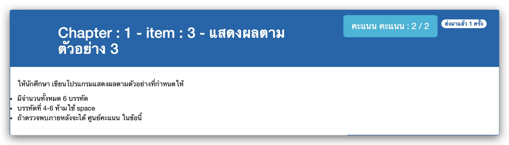

# Chapter : 1 - item : 3 - แสดงผลตามตัวอย่าง 3



[CODE][file] :
```c
#include <stdio.h>

int main() {
    printf("Hello, world!\n");
    printf("Hello, Ladkrabang\n");
    printf("Hello, Computer Programming\n");
    printf("one\ttwo\tthree\tfour\tfive\tHallelujah\n");
    printf("12345678\t12345678\t12345678\t12345678\t12345678\n");
    printf("\t12345678\t12345678\t12345678\t12345678\t12345678\n");
    return 0;
}
```

[file]: ./src/03.c
