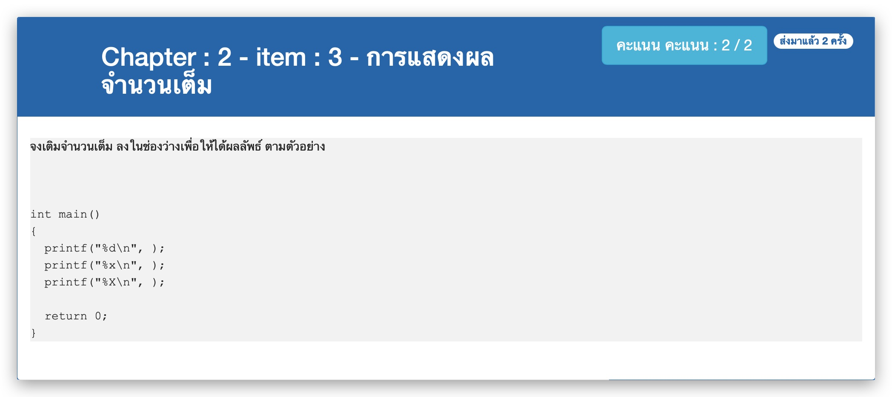

# Chapter : 2 - item : 3 - การแสดงผลจำนวนเต็ม



[CODE][file] :
```
#include <stdio.h>

int main()
{
  printf("%d\n", 65);
  printf("%d\n", 41);
  printf("%s\n", "7F");
  
  return 0;
}
```

[file]: ./src/03.c
