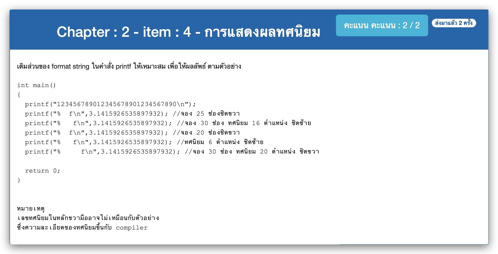

# Chapter : 2 - item : 4 - การแสดงผลทศนิยม



[CODE][file] :
```
#include <stdio.h>

int main()
{
  printf("123456789012345678901234567890\n");
  printf("%25f\n",3.1415926535897932); //จอง 25 ช่องชิดขวา
  printf("%-30.16f\n",3.1415926535897932); //จอง 30 ช่อง ทศนิยม 16 ตำแหน่ง ชิดซ้าย
  printf("%20f\n",3.1415926535897932); //จอง 20 ช่องชิดขวา
  printf("%.6f\n",3.1415926535897932); //ทศนิยม 6 ตำแหน่ง ชิดซ้าย
  printf("%30.20f\n",3.1415926535897932); //จอง 30 ช่อง ทศนิยม 20 ตำแหน่ง ชิดขวา
  
  return 0;
}
```

[file]: ./src/04.c
