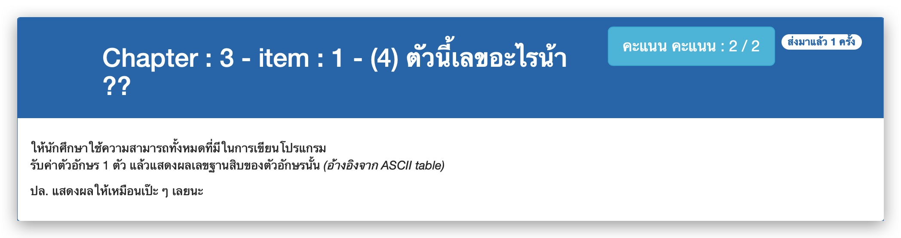

# Chapter : 3 - item : 1 - (4) ตัวนี้เลขอะไรน้า ??



[CODE][file] :
```
#include <stdio.h>

int main() {
    char ch;
    printf("Enter 1 alphabet : ");
    scanf("%c", &ch);
    printf("The ascii of '%c' is %d", ch, ch);
    return 0;
}
```

[file]: ./src/01.c
