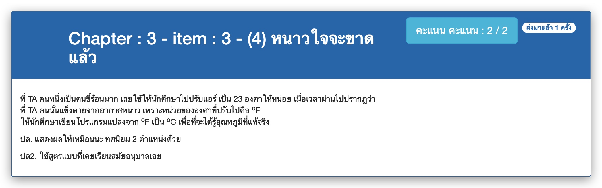

# Chapter : 3 - item : 3 - (4) หนาวใจจะขาดแล้ว



[CODE][file] :
```c
#include <stdio.h>

int main() {
    float fdegree;
    printf("Enter temperature in degree Fahrenheit : ");
    scanf("%f", &fdegree);
    printf("Temparature in degree Celsius : %.2f", (fdegree - 32) * 5 / 9);
    return 0;
}
```

[file]: ./src/03.c
