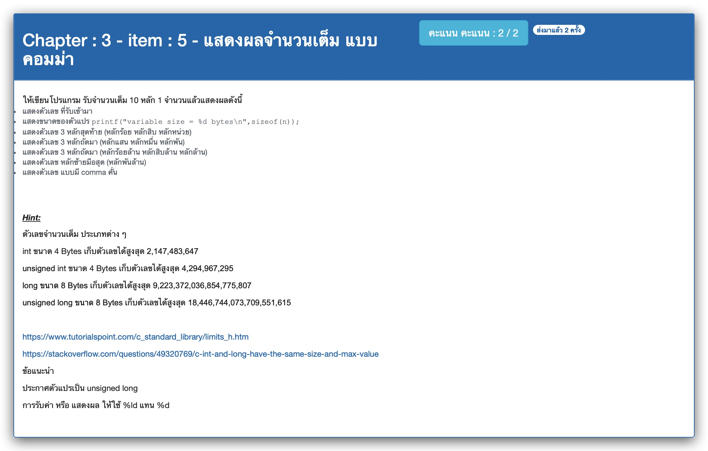

# Chapter : 3 - item : 5 - แสดงผลจำนวนเต็ม แบบคอมม่า



[CODE][file] :
```c
#include <stdio.h>

int main() {
    unsigned long n;
    printf(" *** Display integer in different styles ***\n");
    printf("Enter an integer : ");
    scanf("%ld", &n);
    printf("Your number : %ld\n", n);
    printf("variable size = %ld bytes\n", sizeof(n));
    printf("last 3 digits : %ld\n", n % 1000);
    printf("next 3 digits : %ld\n", (n % 1000000) / 1000);
    printf("next 3 digits : %ld\n", (n % 1000000000) / 1000000);
    printf("next 3 digits : %3ld\n", (n % 1000000000000) / 1000000000);
    printf("comma format  : %ld,%ld,%ld,%ld\n", (n % 1000000000000) / 1000000000, (n % 1000000000) / 1000000, (n % 1000000) / 1000, n % 1000);

    return 0;
}
```

[file]: ./src/05.c
