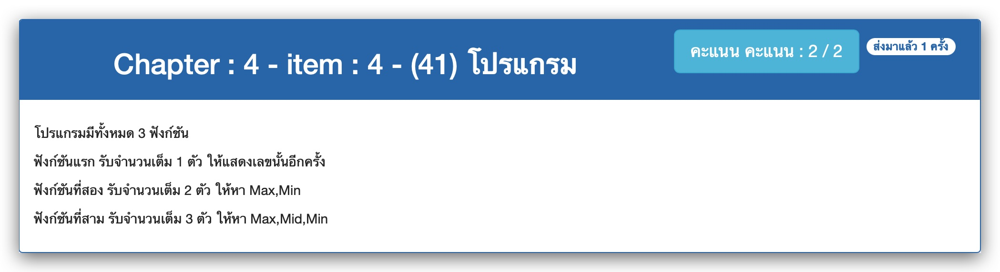

# Chapter : 4 - item : 4 - (41) โปรแกรม



[CODE][file] :
```c
#include <stdio.h>

int main(void) {
  int fn, num1, num2, num3, max, mid, min;
  printf(" *** Program ***\n");
  printf("Enter a function number(1-3) : ");
  scanf("%d", &fn);

  if (fn == 1) {
    scanf("%d", &num1);

    printf("Your number is %d", num1);
  } else if (fn == 2) {
    scanf("%d%d", &num1, &num2);

    if (num1 > num2) {
      max = num1;
      min = num2;
    } else if (num2 > num1) {
      max = num2;
      min = num1;
    } else {
      printf("%d Equal %d", num1, num2);
      return 0;
    }

    printf("Max : %d\n", max);
    printf("Min : %d\n", min);

  } else if (fn == 3) {
    scanf("%d%d%d", &num1, &num2, &num3);

    if (num1 >= num2 && num1 >= num3) {
      max = num1;
    } else if (num2 >= num1 && num2 >= num3) {
      max = num2;
    } else {
      max = num3;
    }

    if (max == num1) {
      if (num2 >= num3) {
        mid = num2;
        min = num3;
      } else {
        mid = num3;
        min = num2;
      }
    } else if (max == num2) {
      if (num1 >= num3) {
        mid = num1;
        min = num3;
      } else {
        mid = num3;
        min = num1;
      }
    } else {
      if (num1 >= num2) {
        mid = num1;
        min = num2;
      } else {
        mid = num2;
        min = num1;
      }
    }

    printf("Max : %d\n", max);
    printf("Mid : %d\n", mid);
    printf("Min : %d\n", min);
  } else
    printf("Your function is ERROR\n");
  return 0;
}
```

[file]: ./src/04.c
