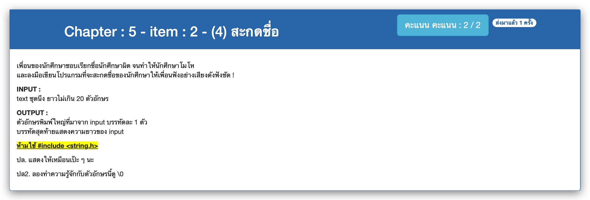

# Chapter : 5 - item : 2 - (4) สะกดชื่อ



[CODE][file] :
```c
#include <stdio.h>

int main() {
    char text[20];
    int index;
    printf("Enter your name : ");
    scanf("%[^\n]", text);
    for (index=0; text[index] != '\0'; index++) printf("%c\n", text[index]-32);
    printf("Name length : %d\n", index);
    return 0;
}
```

[file]: ./src/02.c
