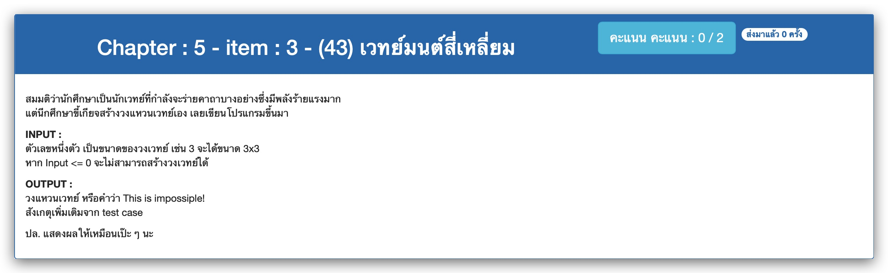

# Chapter : 5 - item : 3 - (43) เวทย์มนต์สี่เหลี่ยม



[CODE][file] :
```c
#include <stdio.h>

int main() {
    int size;
    printf("Enter size of rectangle : ");
    scanf("%d", &size);
    if (size < 1) {
        printf("This is impossiple!");
        return 0;
    }
    for(int i=0; i<size; i++) {
        for(int j=size; j>i; j--) printf(".");
        for (int k = size; k>size-i; k--) printf("/");
        printf("\n");
    }
    return 0;
}
```

[file]: ./src/03.c
