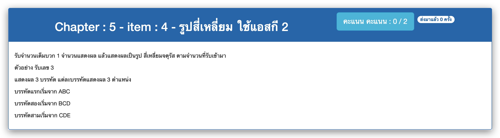

# Chapter : 5 - item : 4 - รูปสี่เหลี่ยม ใช้แอสกี 2



[CODE][file] :
```
#include <stdio.h>

int main() {
    int size;
    printf("Enter a number : ");
    scanf("%d", &size);
    if (size < 1) return 0;

    for(int i=0; i<size; i++) {
        for(int j=0; j<size; j++) printf("%c", 'A'+i+j);
        printf("\n");
    }

    return 0;
}
```

[file]: ./src/04.c
