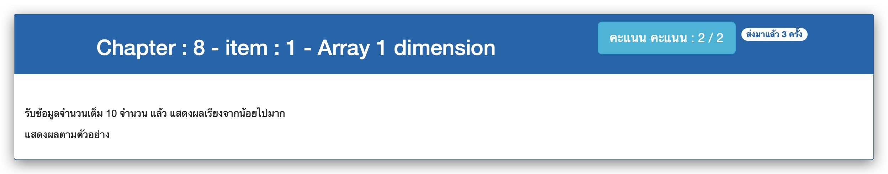

# Chapter : 8 - item : 1 - Array 1 dimension



[CODE][file] :
```c
#include <stdio.h>

#define SIZE 10
int main()
{
    int num[SIZE], temp;
    printf(" *** Ascending sort ***\n");
    printf("Enter %d whole numbers : ", SIZE);
    
    for (int i=0; i<SIZE; i++) scanf("%d", &num[i]);

    for (int j=0; j<SIZE-1; j++) {
        for (int k=0; k<SIZE-1; k++) {
            if (num[k] > num[k+1]) {
                temp = num[k];
                num[k] = num[k+1];
                num[k+1] = temp;
            }
        }
    }

    printf("Output : ");
    for (int i=0; i<SIZE; i++) printf("%d ", num[i]);
}
```

[file]: ./src/01.c
