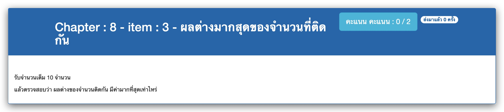

# Chapter : 8 - item : 3 - ผลต่างมากสุดของจำนวนที่ติดกัน



[CODE][file] :
```c
#include <stdio.h>

#define SIZE 10
int main()
{
    int num[SIZE], min, max, maxdiff = 0;
    printf(" *** Maximum diference of adjacent number ***\n");
    printf("Enter %d integers : ", SIZE);

    for (int i=0; i<SIZE; i++) scanf("%d", &num[i]);

    for (int j=0; j<SIZE-1; j++) {
        if (num[j] > num[j+1]) {
            max = num[j];
            min = num[j+1];
        } else {
            max = num[j+1];
            min = num[j]; 
        }

        if ((max-min) > maxdiff) maxdiff = max-min;
    }

    printf("Maximum differnce is %d\n", maxdiff);
}
```

[file]: ./src/03.c
