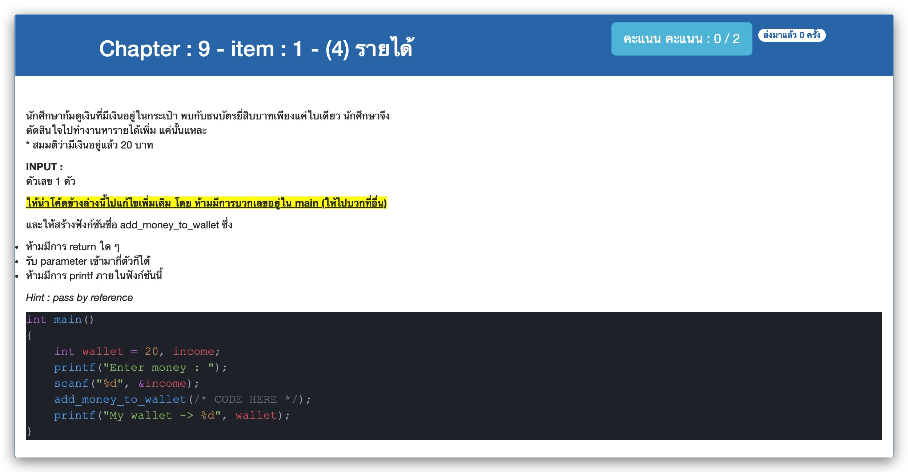

# Chapter : 9 - item : 1 - (4) รายได้



[CODE][file] :
```c
#include <stdio.h>

int add_money_to_wallet(int income, int *ptr);
int main()
{
    int wallet = 20, income;
    int *ptr = &wallet;
    printf("Enter money : ");
    scanf("%d", &income);
    add_money_to_wallet(income, ptr);
    printf("My wallet -> %d", wallet);
}

int add_money_to_wallet(int income, int *ptr) {
    *ptr += income;
}

```

[file]: ./src/01.c
