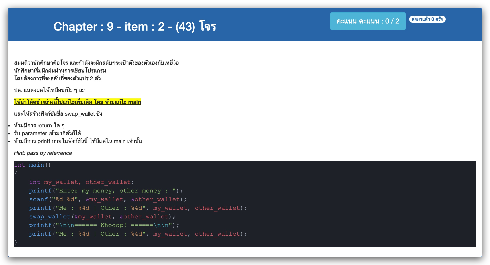

# Chapter : 9 - item : 2 - (43) โจร



[CODE][file] :
```c
#include <stdio.h>

int swap_wallet(int *my_wallet, int *other_wallet);

int main()
{
    int my_wallet, other_wallet;
    printf("Enter my money, other money : ");
    scanf("%d %d", &my_wallet, &other_wallet);
    printf("Me : %4d | Other : %4d", my_wallet, other_wallet);
    swap_wallet(&my_wallet, &other_wallet);
    printf("\n\n====== Whooop! ======\n\n");
    printf("Me : %4d | Other : %4d", my_wallet, other_wallet);
}

int swap_wallet(int *my_wallet, int *other_wallet) {
    int temp = *my_wallet;
    *my_wallet = *other_wallet;
    *other_wallet = temp;
}
```

[file]: ./src/02.c
