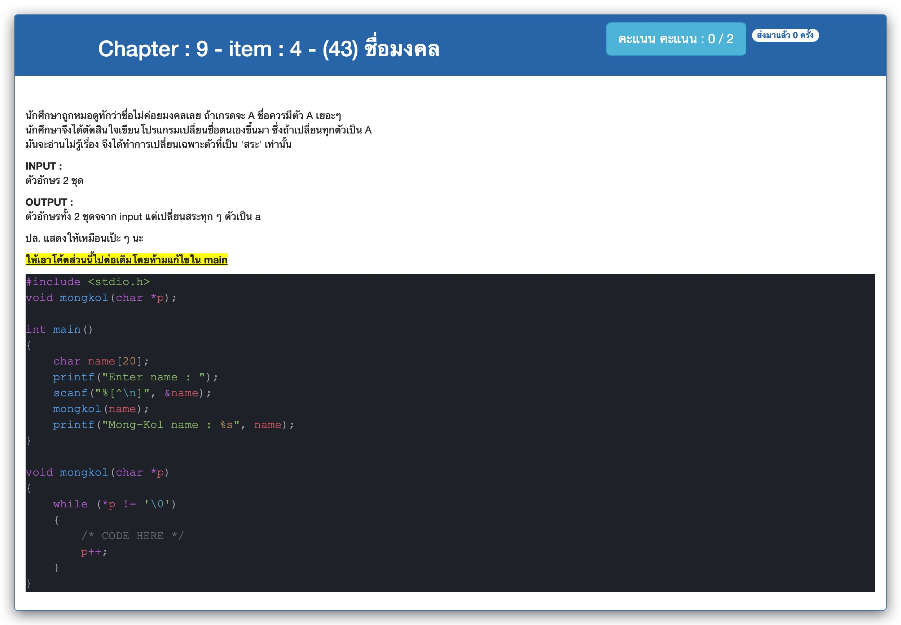

# Chapter : 9 - item : 4 - (43) ชื่อมงคล



[CODE][file] :
```c
#include <stdio.h>
void mongkol(char *p);

int main()
{
    char name[20];
    printf("Enter name : ");
    scanf("%[^\n]", &name);
    mongkol(name);
    printf("Mong-Kol name : %s", name);
}

void mongkol(char *p)
{
    while (*p != '\0')
    {
        if (*p == 'e' || *p == 'i' || *p == 'o' || *p == 'u') *p = 'a';
        if (*p == 'E' || *p == 'I' || *p == 'O' || *p == 'U') *p = 'A';
        p++;
    }
}
```

[file]: ./src/04.c
