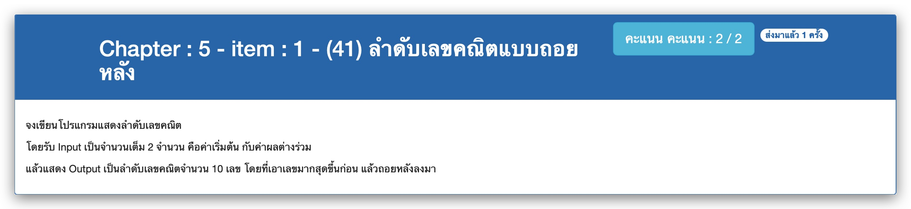

# Chapter : 5 - item : 1 - (41) ลำดับเลขคณิตแบบถอยหลัง



[CODE][file] :
```c
#include <stdio.h>

int main() {
    int result[10], start, diff, index;
    printf(" *** Arithmetic Sequence ***\n");
    printf("Enter 2 Positive Integers: ");
    scanf("%d %d", &start, &diff);
    for(index = 0; index<10; index++) {
        result[index] = start;
        start += diff;
    }
    index--;
    for (index; index>=0; index--) printf("%d ", result[index]);
    return 0;
}
```

[file]: ./src/01.c
